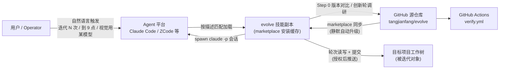
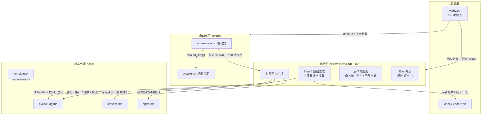
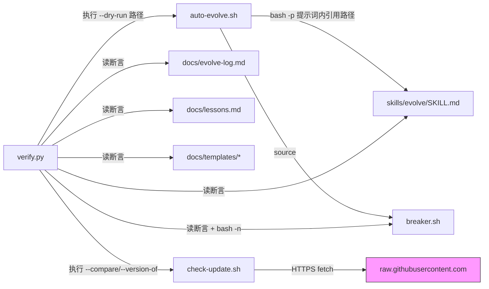
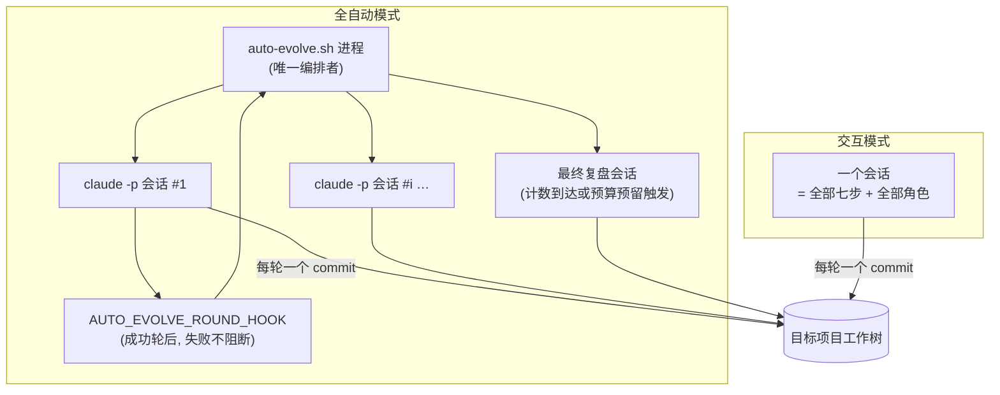
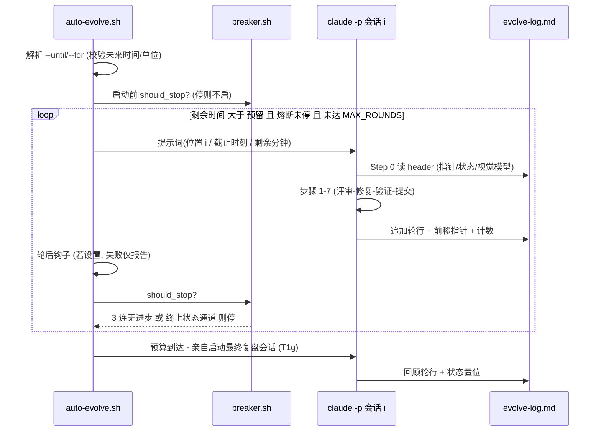
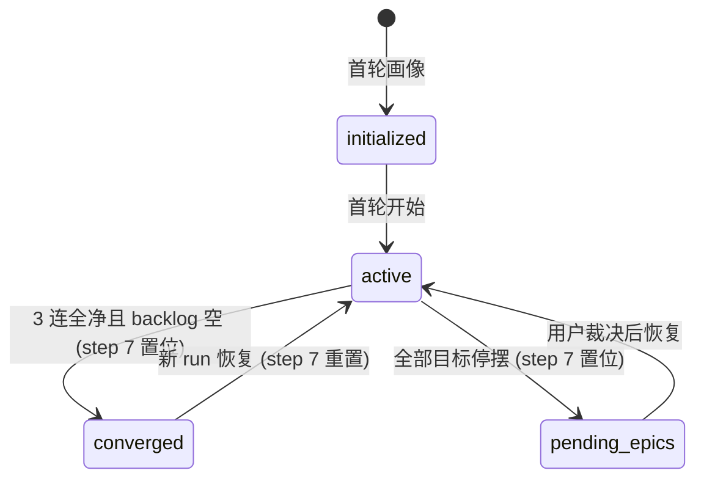
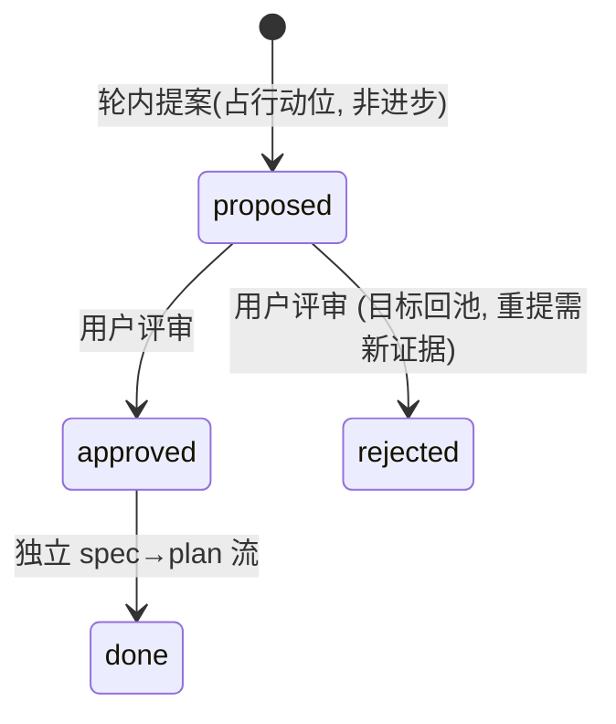

# evolve 架构文档

> 状态快照：v1.5.0+（innovation run #23–#37 已合入 main）。evolve 是一个"技能即产品"的系统：交付物主要是协议文本（SKILL.md）+ Bash/Python 脚本，运行时不在传统进程里，而在 **AI Agent 会话**中——这一点决定了本文档的多数设计。

## 1. Overview

evolve 让任意项目以"N 轮小闭环"持续自我改进：每轮 = 选目标 → 视觉/代码评审 → 修复 → 验证 → 提交 → 记录，进度只认证据（反作弊白名单）。本仓库既是协议的源码，也是协议的第一个自举对象（self-hosting：用自己的轮次迭代自己，37 轮）。范围：协议、验证套件、自动化驱动、版本漂移提示；不含 Agent 平台本身与目标项目的业务逻辑。

## 2. Architecture Context

要点：技能**在平台内执行**但**以仓库为单一事实源**；GitHub→安装缓存是静默单向流，因此需要显式的漂移提示机制（ADR-003）。

## 3. Logical Architecture

四个层是**裁剪关系而非调用关系**：协议层可以被单独手动使用（交互模式），自动化层与质量层是其护栏。

## 4. Component Responsibilities

| Component | 负责 | 不负责 |
|---|---|---|
| SKILL.md（协议） | 轮次语义、目标池与优先级、反作弊标准、回顾轮输出、红线 | 执行任何验证命令（由会话执行）；解析日志（breaker 的事）；决策 epic 批准（用户的事） |
| auto-evolve.sh（驱动器） | 会话编排、位置/截止时间告知、时间预算门、轮后钩子、最终复盘会话启动 | 轮次内容；剖析项目（必须先有交互轮）；熔断判定（委托 breaker.sh） |
| breaker.sh（熔断） | 唯一停机判定源：3 连无进步、converged / pending-epics 状态通道 | 启动/杀死会话；修改日志；判定预算是否用尽（驱动器的事） |
| verify.py（验证套件） | 结构断言（JSON/frontmatter/链接/计数对账）+ 行为 fixture（breaker/dry-run/版本解析）+ 突变探针 | 目标项目的业务测试；修复任何它发现的问题 |
| check-update.sh（漂移提示） | 对比本地与远程版本号，打印一行提示；24h 抓取缓存 | 自我更新（红线：升级归用户的插件管理器）；提示以外的任何输出 |
| docs/templates/（模板） | 新项目的三份状态文件起始结构 + 种子教训 S1–S5 | 运行期写入（运行期写的是项目自己的 docs/） |
| verify.yml（CI） | push/PR 时运行 verify.py | 部署；发布；任何写操作 |

## 5. Dependency Architecture

外部依赖刻意极少：`bash`（GNU date 语义用于 `--until`）、`python 3.12+`（仅标准库）、`git`、`curl`。无第三方包——验证套件必须能在 CI 与任意 headless 会话中裸跑（E3/E6：权限层是自主性的第一堵墙）。

## 6. Runtime / Deployment Architecture

关键运行时约束：**单写者每树**（E9，实测并发碰撞教训）——同一工作树要么一个交互会话、要么一个驱动器，绝无并行会话写；驱动器与会话串行（上一会话退出才启动下一个）。安装形态两种：plugin marketplace（版本快照到缓存目录）或手动复制 SKILL.md + templates + scripts。

## 7. Key Sequence — 预算型自动 run

计数模式（`<rounds>`）走同一序列，仅循环退出条件不同（`launched > N`）。预算只在轮边界生效——**绝不中途杀死会话**（ADR-001）。

## 8. Interface / Contract

### 8.1 进程/函数接口

| Interface | Direction | Transport | Payload | Sync/Async | Error |
|---|---|---|---|---|---|
| `should_stop <log>` | driver → breaker（source 亦可独立执行） | bash 函数 / exit code | evolve-log 路径；stdout 输出 `breaker_reason`（no-progress/converged/pending-epics） | Sync | 日志缺失/畸形 → fail-safe 方向 |
| `python scripts/verify.py` | 会话/CI → 套件 | exit code + stdout | 无参数；逐行 `[PASS/FAIL]` + 汇总 `N/N checks` | Sync | 任一 FAIL → exit 1（全绿才准提交） |
| `claude -p "<prompt>"` | driver → 平台 CLI | 子进程 | 位置/预算提示词 + 五态 result 词汇表 | Sync（阻塞至轮结束） | 非 0 退出计连续失败，3 连停 |
| `check-update.sh [--compare A B] [--version-of f]` | Step 0 → 脚本 | stdout | 环境变量 `EVOLVE_VERSION_URL` / `EVOLVE_CACHE_FILE` | Sync，5s 超时 | 离线/畸形 → 静默 exit 0（绝不阻塞轮次） |
| `AUTO_EVOLVE_ROUND_HOOK` | driver → 任意命令 | `sh -c` | 环境变量注入 | Sync | 失败仅报告（advisory） |

### 8.2 CLI / 环境变量契约

| 参数 / 变量 | 取值 | 语义 |
|---|---|---|
| `<rounds>` | 正整数（默认 5） | 计数终止 |
| `--until <datetime>` | GNU date 可解析的**未来**时间 | 截止终止（Git Bash/Linux 可用；macOS 需 coreutils） |
| `--for <duration>` | `5h` / `90m`（必须带单位） | 时长终止；与轮数互斥 |
| `--dry-run` | 前缀标志 | 打印计划（项目/轮数或预算/指针/熔断/钩子），零会话 |
| `--danger` | 标志 | 跳过权限确认（仅可信项目） |
| `AUTO_EVOLVE_MIN_RESERVE` | 秒，默认 900 | 预留量：剩余不足则转入最终复盘会话 |
| `AUTO_EVOLVE_MAX_ROUNDS` | 整数，默认 0=不限 | 长预算封顶 |

### 8.3 数据契约（evolve-log header）

| 字段 | 读者 | 语义/守护 |
|---|---|---|
| `- verify:` | 每轮 step 5、verify.py | 轮次锁定：变更需独立 commit（反作弊 #4） |
| `- pointer:` | Step 0、driver | 断点续跑的唯一游标 |
| `- rounds done:` | verify.py | ≡ 轮行数（套件强制） |
| `- status:` | breaker、step 7 | initialized/active/converged/pending-epics；step 7 是唯一 setter/reseter（E11） |
| `- metrics: findings n \| fixes n \| regressions n` | verify.py | findings ≡ Σ轮行（严格相等，#33 实测违约后套件强制）；fixes ≤ Σactions |
| `- epics pending:` | Step 0、回顾轮 | EP-id 或 none |
| `- visual-model:` | step 2 | 可选；用户指定的视觉评审模型，缺省 haiku |
| `- push: auto-authorized` | step 6 | 唯一的自动推送授权声明 |
| 轮行 `#n \| target \| findings(a) \| actions(b) \| result(五态, tests) \| diff(l) \| notes` | breaker（读 result 字段）、回顾回放 | result 词汇表被 breaker 用形状匹配防护伪造（#12） |

## 9. State / Lifecycle

header `- status:` 状态机（breaker 的停机通道 = 终态）：

epic 提案生命周期（`docs/epics.md`，轮次永不执行提案）：

轮次结果五态（互斥）：`green+progress`（白名单凭证之一）/ `green+no-progress` / `red` / `blocked` / `interrupted`——breaker 只对 no-progress 计连击。

## 10. Data Model

状态全部外置在目标项目的 `docs/`（ADR-008），三文件职责：

| 文件 | 结构 | 写者 | 读者 |
|---|---|---|---|
| evolve-log.md | header 块 + `## Target pool`（T1–T4 分层）+ `## Rounds`（每轮一行）+ run summary 块 | 会话（唯一写者） | driver、breaker、verify.py、下一个会话 |
| lessons.md | 分类表：`id/lesson/how-to-apply/source/verified` 五列；种子行 S1–S5；轮内捕获 verified 0 | 会话（轮内 + 回顾轮） | Step 0、回顾轮 |
| epics.md | 提案登记：type/trigger/hypothesis/sketch/status | 会话（仅提案） | Step 0（防重提案）、回顾轮（防腐烂复查） |

## 11. Non-Functional Requirements

| Category | Requirement |
|---|---|
| Verifiability | 133 项自动检查全绿才可提交；CI 对每个 push 强制执行 |
| Latency budget | 远程抓取 ≤5s 超时；版本对比缓存 24h（50 轮 run 最多 1 次真实抓取 +1） |
| Reversibility | 每轮 diff ≤ ~300 行；回滚 = 整轮 `git revert`，日志冲突时保留记录 |
| Compatibility | bash（Git Bash/Linux；`--until` 需 GNU date）、Python 3.12+（仅标准库）、git、curl |
| Autonomy safety | 破坏性操作自主模式一律禁止；无确认可行操作 → `result(blocked)` 而非硬闯 |
| Cost | dry-run 零成本预演；预算型 run 有预留+封顶双闸 |

## 12. Key Decisions (ADR)

| ID | Decision | Status | Alternatives | Reason | Impact |
|---|---|---|---|---|---|
| ADR-001 | 时间预算采用协作式（轮边界检查 + 预留 + driver 亲自启动复盘会话） | Accepted | `timeout 5h` 硬杀 | 硬杀丢未提交轮工作（业界共识：预算在循环顶部检查） | 末轮可略超截止 |
| ADR-002 | 熔断规则提取 breaker.sh 单源，套件以 24 个 fixture 日志做行为断言 | Accepted | 驱动器内联 + 子串检查源码 | 子串探针挡不住行为翻转变异（15/15 变异体全部行为级击杀） | 判定逻辑改动必须过 fixture |
| ADR-003 | 漂移通知只提示一行、绝不自更新、离线静默 | Accepted | 技能自更新 | 升级归用户的插件管理器；静默失败优于阻塞轮次 | 版本延迟可见 ≤24h（缓存 TTL） |
| ADR-004 | 教训轮内即时捕获（verified 0），不等回顾轮 | Accepted | 只在回顾轮落库 | run 早夭不丢教训（实测：E11 拖了 4 轮才落库）；E12/E13/E14 均当轮捕获 | 回顾轮仍负责首次核verify |
| ADR-005 | 回滚以整轮 commit 为单位；log 冲突时保留全部记录 | Accepted | 文件级快照恢复 | Gemini CLI 回滚事故：盲恢复抹平半更新状态 | 非最新轮回滚需手工解决 log 冲突（程序已写明） |
| ADR-006 | 进步白名单制：测试增长/先红后绿/度量改善/验收员确认 | Accepted | 会话自述"做了什么" | 叙述性进步不可审计；自举 run 曾产 15 变异体攻击面 | 无凭证轮诚实记 no-progress，3 连熔断 |
| ADR-007 | 视觉评审模型默认 haiku、用户指定优先（header `- visual-model:`） | Accepted | 硬编码 haiku | haiku 在 ZCode/GLM 等平台不存在；机制本质是"便宜的眼睛" | 非 Claude 平台开箱可用 |
| ADR-008 | 状态外置目标项目 docs/ + 单写者每树 | Accepted | 平台内状态/并行会话 | 断点续跑根基；实测并发碰撞（两会话一树互毁） | 状态与代码同 commit 原子演进 |
| ADR-009 | 每轮 diff ≤ ~300 行 | Accepted | 大票一次性落地 | 每轮可独立 revert 与回放审计 | 大功能走 Epic 升级 spec→plan |
| ADR-010 | header findings ≡ Σ轮行（严格），fixes ≤ Σactions（不等式） | Accepted | 仅人工对账 | E4 实测漂移（#27 差一），人工对账在自身教训上翻车 | #33 起套件强制，漂移即红 |

## 13. Risks / Open Issues

| ID | Issue / Risk | Impact | Status | Owner |
|---|---|---|---|---|
| R-001 | 技能名冲突：`everything-claude-code:evolve` 抢占裸 `/evolve`（T1a） | Low | Mitigated（双语 README 歧义说明；driver 提示词直接读文件） | 环境 |
| R-002 | 干净环境手动安装路径从未实测（T1c，需真人 + 干净机器） | Medium | Open | operator |
| R-003 | tag 之间的提交以旧版本号被 marketplace 装走（现 main > v1.5.0 但版本号未动） | Low | Open（run 收尾发 v1.6.0 即闭合） | 下一轮 |
| R-004 | breaker 残差 I2–I4：需整体伪造 result 语法才可触发的理论攻击面 | Low | Deferred（fail-safe 方向） | — |
| R-005 | 时间预算（--until/--for）与轮后钩子未经真实长跑验证 | Medium | Open（本 run 后半段可安排一次小预算实跑） | 下一轮 |
| R-006 | headless 会话权限白名单与平台 shell 工具不匹配（E6：Bash(...) 不覆盖 PowerShell 会话） | Medium | Documented（driver 头注释 + README） | 用户 |

## 待确认项

- [ ] marketplace 静默升级的确切触发时机（实测发生在客户端启动/新会话边界，无官方文档佐证）（推断）
- [ ] `AUTO_EVOLVE_ROUND_HOOK` 在 PowerShell 会话下的 allow-list 覆盖情况（沿用 E6 结论，本轮未复验）（推断）
- [ ] check-update 24h 缓存内连续发布两个新版本时的可见性延迟（设计使然，双版本场景未实测）
- [ ] `claude -p` 对超长提示词（预算型轮的位置文案）的平台侧截断行为（推断无影响，未验证）
